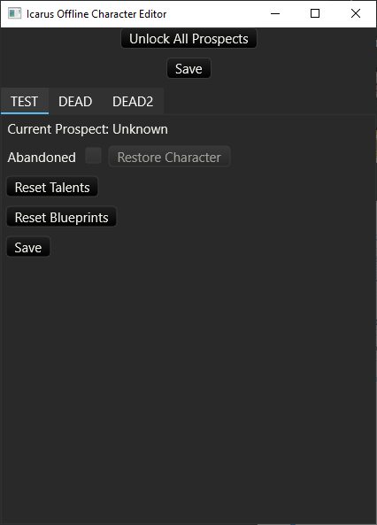
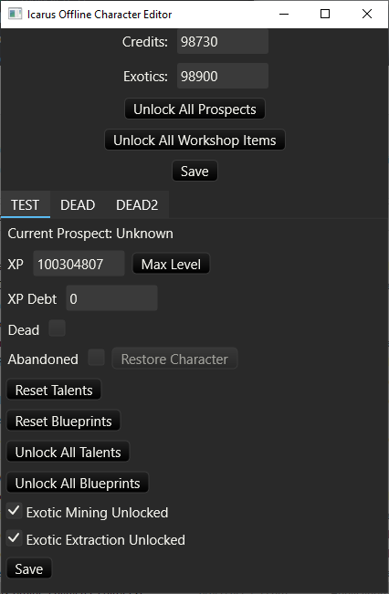

# Icarus Offline Character Editor
Basic GUI editor for *offline* characters for the game Icarus: First Cohort
([Steam Page](https://store.steampowered.com/app/1149460/ICARUS/))

Some stuff

## Installation
There are two versions of the program provided - one will allow you to restore dead/abandoned
characters, unlock all prospects, and reset your Talents and Blueprints. The other provides a
more comprehensive set of functionality, allowing you to set your credits, exotics, unlock
workshop items, set the XP of your character, unlock _all_ talents (more than is normally possible),
and so on. Compare the two versions:

Minimal Version:

Full Version:

### "No Cheats" version

Look for the [latest release](https://github.com/ipsi/icarus-offline-character-editor/releases)
and download the file ` icarus-offline-character-editor-<version>-nocheats.tar.gz`.
Decompress the archive and extract the file ` icarus-offline-character-editor.exe` somewhere, then
run it. The application will start.

### "Full" version

Look for the [latest release](https://github.com/ipsi/icarus-offline-character-editor/releases)
and download the file ` icarus-offline-character-editor-<version>-full.tar.gz`.
Decompress the archive and extract the file ` icarus-offline-character-editor.exe` somewhere, then
run it. The application will start. 

## Usage
Run the program.

Make changes to your character. Not all functions are implemented yet.

Click save to save changes. Clicking any save button saves changes to
_all_ characters and to your global profile.

## WARNING
This could destroy any or all of your offline data. It is _strongly_
recommended that you backup the folder `%APPDATA\Local\Icarus\Saved\Offline`
before using this tool.
